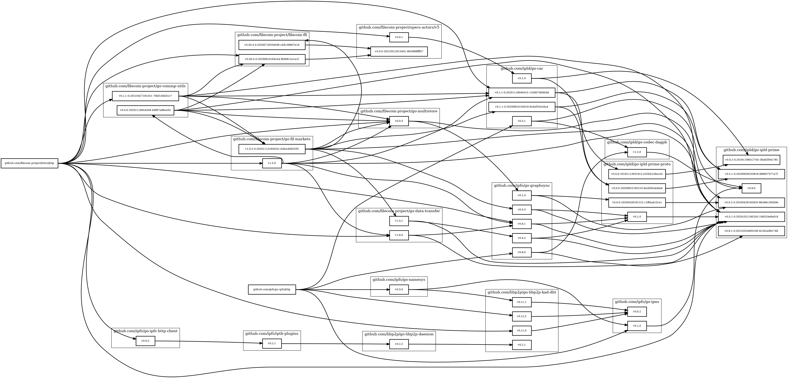

go-depchart
===========

This is a quick-and-dirty tool for drawing graphs of golang module relationships.

Its purpose is to visualize what kind of relationship downstream repos have to an upstream repo.
The intention is that this should be useful information for:

- planning changes in the upstream repo and seeing what their impact will be;
- to help coordinate propagating any changes down through the graph;
- and to see the overall "health" of the graph (how many different versions does it contain?).

The level of polish of this tool is currently not high.
Certain behaviors are hardcoded.
Some setup is required.

Example Output
--------------

Here's an example of kind of the output one might see from this tool:

In this example, there were two "start" repos (you'll seem them relatively to the left),
and one "focus" repo (all the way on the right).

As you can see, it's entirely possible to end up with six different versions of an upstream repo
being referenced by just two downstreams (intermediate modules can cause fanout).

If you looked at this example in your own projects, probably what you'd want to do is:
find whichever module's subgraph has the most versions inside of it,
and then start upgrading things downstream of those to make the graph get smaller.
Smaller lists of versions being used within each module is a happer graph:
it means you'll be doing less maintinence and have more freedom to move.

License
-------

SPDX-License-Identifier: Apache-2.0 OR MIT
